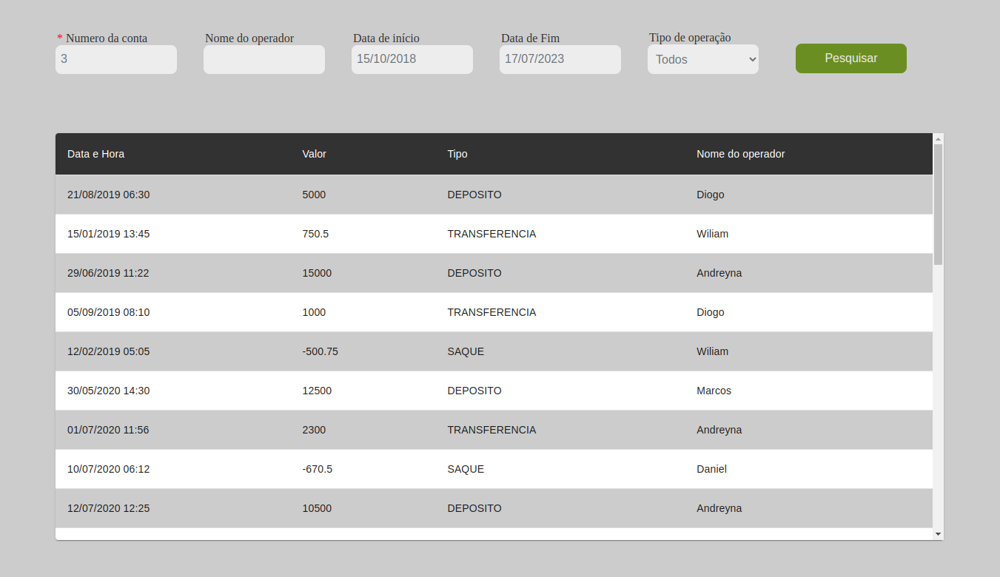
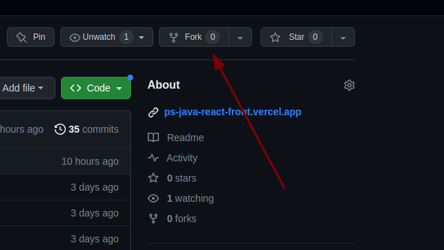
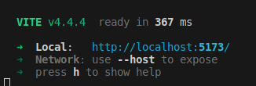

## Link da aplicação em Deploy (FRONTEND)
https://ps-java-react-front.vercel.app/

## Link da aplicação em Deploy (BACKEND)
https://ps-java-react-production.up.railway.app/transfers/3


# PS JAVA React

## Descrição 

- Este é um sistema para emissão de extrato bancário, onde você tem acesso a um relatório de suas movimentações financeiras.

voce filtrar por:
 - Periodo de datas(início de fim de uma movimentação)
 - Nome do operador transacional
 - Tipo de operação ( Saque, Transferência ou Depósito)
 - se nenhum filtro for informado, ele exibe todas as movimentações pela número da sua conta
 - se todos os filtros forem informados(Datas de início/fim, operador e tipo de operação) será exibido as transferências baseado nas datas e nome do operador


## Requisitos de sistema

- Ter instalado o Node.js
- um gerenciador de depêndencia (NPM ou Yarn)

## Como executar a aplicação Localmente 

- Faça o Fork desse repositório em sua conta do github


- em sua máquina, abra um terminal e faça o clone da aplicação
#### Com  HTTPS
   
```
https://github.com/DgSantos017/PS-Java-React-front.git
```

#### ou com  SSH
```
git@github.com:DgSantos017/PS-Java-React-front.git
```
- Entre no diretório da aplicação
```
cd PS-Java-React-front
```
- instale as dependências 
#### obs. aqui vou usar o Yarn mas poderia ser também com NPM
   
```
yarn
```

Inicie a aplicação:
```
yarn vite
```

Se todos os passos forem executados corretamente, a aplicação vai rodar nesse endereço:
http://localhost:5173/



# Libs ultilizadas além do React.js
- Material-UI
- react-toastify
- Axios
- react-datepicker
- styled-components


#### Meus contatos

Linkedin
https://www.linkedin.com/in/diogo-santos01/

Gmail
diogosantosferreira.01@gmail.com

Watsapp: 98 988837650

Thanksss :)